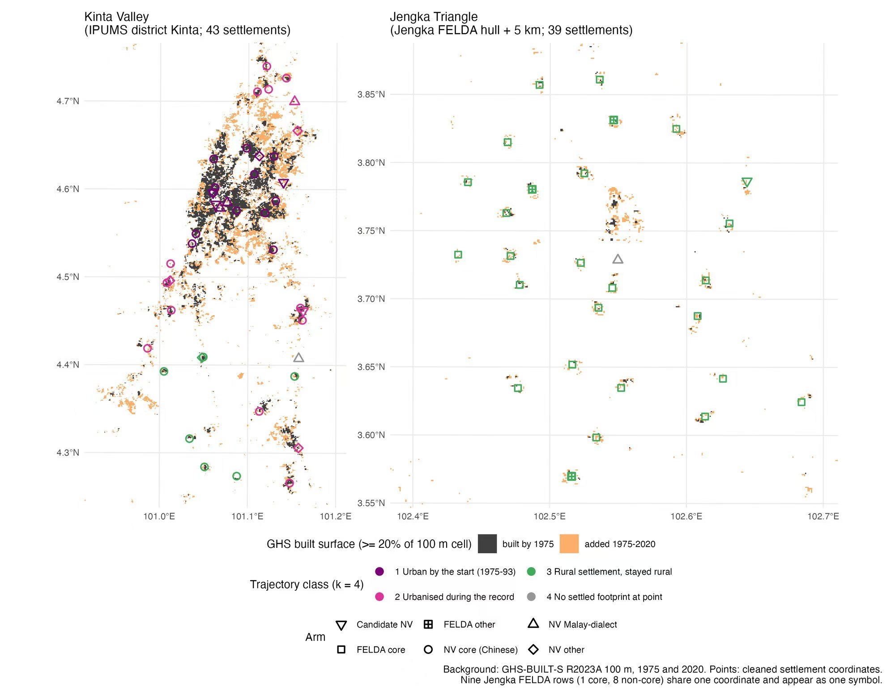
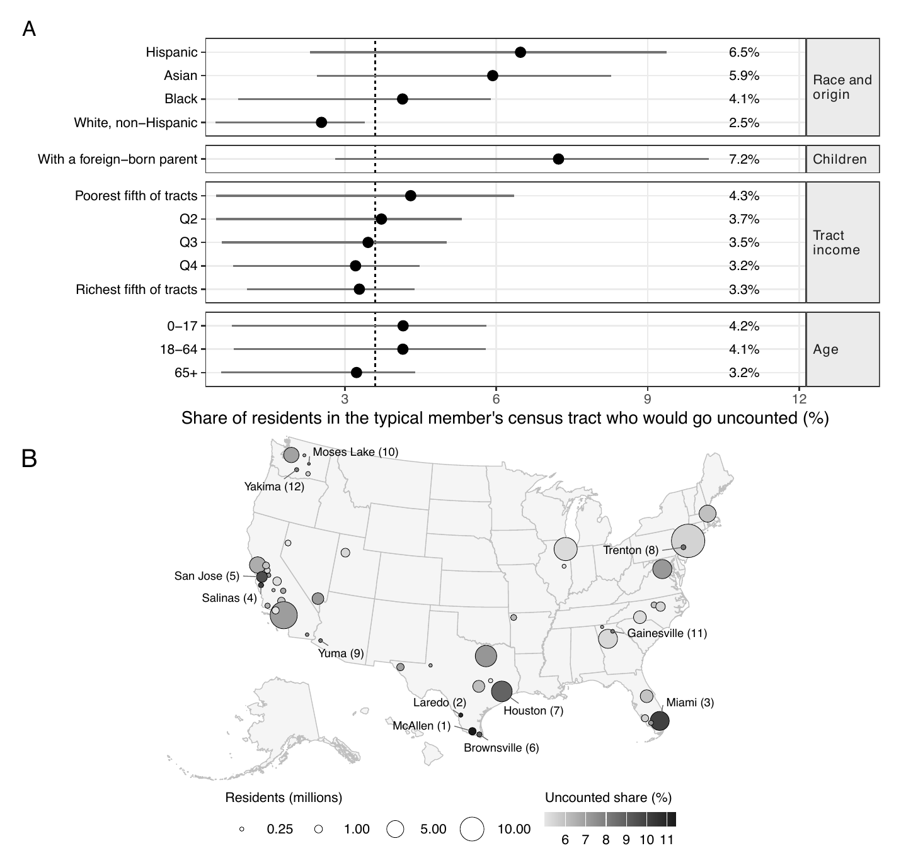

::: {.policy-figs}

::: {.policy-fig}
{fig-alt="Map of two Malaysian settlement regions, Kinta Valley and the Jengka Triangle, showing built surface in 1975 and added by 2020, with settlements colored by urbanization trajectory." group="policy-figs" description="Urbanization around Chinese New Villages (Kinta Valley) and FELDA settlements (Jengka Triangle), Malaysia. Built surface from GHS-BUILT-S, 1975 and 2020."}

**Figure 1.** Urbanization around Chinese New Villages (Kinta Valley) and FELDA settlements (Jengka Triangle), Malaysia, 1975 to 2020.
:::

::: {.policy-fig}
{fig-alt="Panel A shows the share of residents in the typical member's census tract who would go uncounted, by race and origin, parentage, tract income, and age. Panel B maps places by number of residents and uncounted share." group="policy-figs" description="Who would go uncounted under the proposed census rule. (A) By group. (B) By place."}

**Figure 2.** Who would go uncounted under the proposed census rule, by group (A) and by place (B).
:::

:::

```{=html}
<script>
// On wide screens, move the figures into a column under the photo.
document.addEventListener("DOMContentLoaded", function () {
  var figs = document.querySelector(".policy-figs");
  var img = document.querySelector(".quarto-about-solana .about-entity > img.about-image");
  if (!figs || !img) return;
  var home = document.createComment("policy-figs");
  figs.parentNode.insertBefore(home, figs);
  var col = document.createElement("div");
  col.className = "about-photo-col";
  var mq = window.matchMedia("(min-width: 992px)");
  function place() {
    if (mq.matches) {
      if (!col.parentNode) { img.parentNode.insertBefore(col, img); col.appendChild(img); }
      col.appendChild(figs);
    } else {
      if (col.parentNode) { col.parentNode.insertBefore(img, col); col.remove(); }
      home.parentNode.insertBefore(figs, home.nextSibling);
    }
  }
  place();
  mq.addEventListener("change", place);
});
</script>
```

::: {.lead}
Hi, I'm Tyler! Welcome to my website.
:::

I am a Ph.D. candidate in Political Science and Scientific Computing at the
University of Michigan, where I am also completing an M.A. in Statistics. I study the
relationship between political parties and the populations beneath them. Party systems stand on
social groups, and I ask what happens when the groups move. My work combines comparative
politics, with a focus on dominant parties and communal politics in Southeast and East Asia, and
political methodology, with a focus on ecological inference. I read my cases in Chinese, Malay,
Indonesian, and Japanese.

My dissertation, "Moving Ground: Three Papers on Elites, Voters, and the Breakdown of Dominant
Party Systems," asks how parties that dominated their countries' politics for decades lose the
ability to dominate. Breakdown, I argue, takes two forces meeting. Populations shift beneath the
party, and defecting elites attach their new vehicles to the ground that has moved. The first
paper *Choosing Voters* shows how competitive authoritarian regimes can combine population policy
and categorical redistricting to build electoral districts that can sustain their rule through
multiple elections. The second paper *Dancing with Hands Tied* follows 4,638 candidate-elections
across Malaysia's UMNO, Japan's LDP, and Taiwan's KMT to show that defection ends dominance only
when a breakaway party captures a social cleavage the parent cannot absorb. The third paper builds
BACH, a simulation-based ecological-inference framework that recovers how each demographic
subgroup votes from aggregate election returns.

The plan is for the dissertation to grow into a book, "The Tower of Babel We Bury." The
dissertation takes the groups as given and shows how their movement breaks parties. The book asks
where the groups came from. Parties do not merely mobilize social groups. They make them, and
campaigning on a made group means burying the differences inside it. The book follows buried
difference from its colonial origins to its resurfacing across Malaysia, Taiwan, and the United
States. My fieldwork runs from the Malay neighborhoods of Kuala Lumpur and the coastal villages
of Terengganu to the Detroit suburbs and New York City's three Chinatowns.

My research appears in the *Journal of East Asian Studies* and, with Congcong Fu, in the two
leading Chinese-language journals of Southeast Asian studies. Three further papers are under
review. I study what happens when the ground beneath a party shifts, and I build the instruments
to measure it.

My papers, datasets, and CV are linked above.

I am on the 2026–27 academic job market.

Outside the academy, I am the dad of two black cats, Erik and Theda, and a volunteer foster
with the [Humane Society of Huron Valley](https://www.hshv.org/).

```{=html}
<script type="application/ld+json">
{
  "@context": "https://schema.org",
  "@type": "Person",
  "@id": "https://tylerrongxuanchen.github.io/#person",
  "name": "Tyler Rongxuan Chen",
  "url": "https://tylerrongxuanchen.github.io/",
  "image": "https://tylerrongxuanchen.github.io/assets/profile.jpg",
  "jobTitle": "Ph.D. Candidate in Political Science and Scientific Computing",
  "description": "Political scientist studying the elite origins and the societal foundations of political parties and party systems, and building ecological-inference tools to recover group voting behavior, with fieldwork and data work on Malaysia, Taiwan, Japan, Indonesia, and the United States.",
  "email": "mailto:tylercr@umich.edu",
  "affiliation": {
    "@type": "CollegeOrUniversity",
    "name": "University of Michigan",
    "department": "Department of Political Science"
  },
  "alumniOf": {
    "@type": "CollegeOrUniversity",
    "name": "University of Michigan"
  },
  "knowsAbout": [
    "Comparative politics",
    "Political methodology",
    "Political parties and party systems",
    "Elections and electoral behavior",
    "Ecological inference",
    "Spatial analysis",
    "Measurement error",
    "Ethnic and urban-rural cleavages",
    "Malaysian politics",
    "Southeast Asian politics",
    "East Asian politics"
  ],
  "knowsLanguage": ["English", "Chinese", "Malay", "Indonesian", "Japanese"],
  "identifier": {
    "@type": "PropertyValue",
    "propertyID": "ORCID",
    "value": "0009-0007-9694-5533",
    "url": "https://orcid.org/0009-0007-9694-5533"
  },
  "sameAs": [
    "https://orcid.org/0009-0007-9694-5533",
    "https://scholar.google.com/citations?user=xayX394AAAAJ&hl=en",
    "https://prod.lsa.umich.edu/polisci/people/graduate-students/tyler-chen.html",
    "https://github.com/tylerrongxuanchen"
  ]
}
</script>
```
